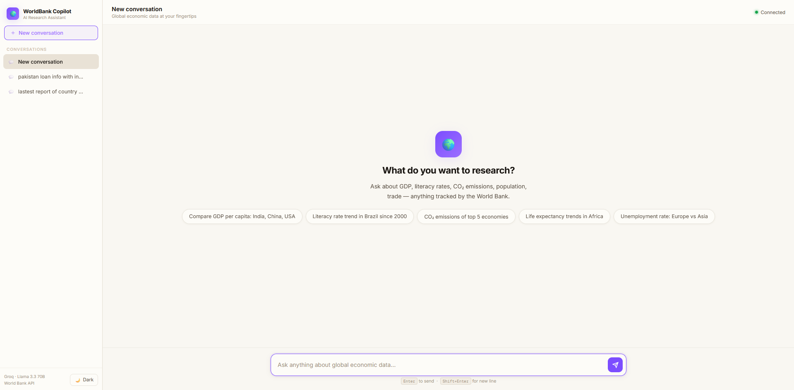

# 🌍 WorldBank Research Copilot



AI-powered global development data analysis with **parallel tool calling** and **data pipeline**.

## 🎯 What This Does

Ask natural language questions about global economics — the AI agent fetches real data from the World Bank API, analyzes it, and gives you insights with actual numbers.

**Key engineering feature:** When comparing multiple countries, the system fires all API requests **in parallel** using `asyncio.gather()`, achieving ~70% latency reduction vs sequential calls.

## 🏗️ Architecture

```
User Question
     │
     ▼
┌─────────────────┐
│  FastAPI Server  │  ← /research, /compare, /metrics
└────────┬────────┘
         │
         ▼
┌─────────────────┐
│  Copilot Agent   │  ← Groq LLM (Llama 3.3 70B)
│  (Tool Calling)  │
└────────┬────────┘
         │
    ┌────┴────┐
    ▼         ▼
┌────────┐ ┌────────────┐
│ Single │ │  Parallel   │  ← asyncio.gather()
│ Fetch  │ │  Compare    │
└───┬────┘ └─────┬──────┘
    │            │
    ▼            ▼
┌─────────────────┐
│  World Bank API  │  ← Free, no key needed
└────────┬────────┘
         │
         ▼
┌─────────────────┐
│  Cache Layer     │  ← In-memory cache (TTL-based)
└─────────────────┘
```

## 📊 Data Pipeline

The project includes a **production-style data ingestion pipeline** (same pattern as real data engineering work):

```
WB API (JSON) → Normalize (CSV) → Persist (SQLite) → Audit Log
```

- Downloads bulk indicator data for 20 countries
- Normalizes nested JSON into clean CSV files
- Persists into SQLite with deduplication
- Logs every pipeline run for auditability

## 🛠️ Tech Stack

| Component | Technology |
|-----------|-----------|
| LLM | Groq (Llama 3.3 70B) - free tier |
| API | World Bank WDS API - free, no key |
| Framework | FastAPI (async) |
| Caching | In-memory (TTL-based, zero dependencies) |
| Token Management | tiktoken |
| Database | SQLite (pipeline storage) |
| Async | Python asyncio + aiohttp |

## 📁 Project Structure

```
P2-WorldBank-Copilot/
├── app/
│   ├── __init__.py
│   ├── main.py              ← FastAPI server
│   ├── agents/
│   │   └── copilot.py       ← Main AI agent with tool calling
│   ├── tools/
│   │   └── wb_api.py        ← WB API client (parallel + cached)
│   ├── pipeline/
│   │   └── ingest.py        ← Data pipeline (fetch → CSV → SQLite)
│   ├── cache/
│   │   └── cache_manager.py ← In-memory TTL cache
│   └── utils/
│       ├── config.py        ← Centralized config
│       └── token_budget.py  ← Token budget manager
├── tests/
│   └── test_wb_api.py       ← Unit tests
├── data/                    ← Generated by pipeline (gitignored)
├── frontend/                ← Production HTML/JS frontend (for dev/presentation)
├── streamlit_app.py         ← Quick Streamlit UI for internal testing
├── start.py                 ← One-command launcher for all services
├── .env.example
├── .gitignore
├── pyproject.toml       ← uv project config & dependencies
├── requirements.txt     ← pip fallback
├── TESTING.md
└── README.md
```

## 🚀 Quick Start

> **This project uses [uv](https://docs.astral.sh/uv/) for fast, reproducible Python environments.**
> Install uv once with: `pip install uv` (or `winget install astral-sh.uv` on Windows)

### 1. Clone and set up

```bash
git clone https://github.com/yourusername/WorldBank-Research-Copilot.git
cd WorldBank-Research-Copilot

# Create venv + install all dependencies in one step
uv sync
```

### 2. Set up environment

```bash
cp .env.example .env
# Edit .env and add your GROQ_API_KEY (free at console.groq.com)
```

### 3. Run the data pipeline (optional but recommended)

```bash
# Quick mode - 3 indicators, 5 countries (~30 seconds)
uv run python -m app.pipeline.ingest --quick

# Full mode - 10 indicators, 20 countries (~3 minutes)
uv run python -m app.pipeline.ingest
```

### 4. Start the backend server

```bash
uv run uvicorn app.main:app --reload --port 8002
```

Verify it is up:

```bash
curl http://localhost:8002/health
# Expected: {"status": "ok"}
```

---

## 🖥️ Running the User Interfaces

### Option A — Production Frontend (HTML/JS Dashboard)

> Use this when presenting the project to developers or recruiters.
> **No Node.js required** — it's a single static HTML file.

```bash
# Simply open in your browser:
start frontend/index.html       # Windows
open frontend/index.html        # macOS
xdg-open frontend/index.html    # Linux
```

Or serve it with any static server for a proper URL:

```bash
# Using Python's built-in server (port 3000)
cd frontend
python -m http.server 3000
# Open http://localhost:3000
```

**What you get:** A full dark-themed dashboard with four panels — Research chat, Country Compare, Data Pipeline runner, and live Metrics. It connects directly to the FastAPI backend on `port 8002`.

> **Note:** The backend must be running before the frontend can fetch any data.

---

### Option B — Internal Testing UI (Streamlit)

> Use this for quick iterative development and testing new backend features.
> No browser setup — pure Python.

```bash
# From the project root
uv run streamlit run streamlit_app.py
# Opens at http://localhost:8501
```

Features available in Streamlit:
- 💬 **Research chat** — ask natural language economics questions
- ⚡ **Parallel comparison sidebar** — directly compare N countries by indicator code
- 🔍 **Indicator search** — look up World Bank indicator codes
- 📊 **Live performance metrics** — cache hit rate and latency

> **Note:** Backend must be running on `port 8002` before using Streamlit.

---

### Running Everything at Once

You can use the provided launcher to start all three services (FastAPI, Streamlit, and Frontend) with a single command:

```bash
uv run python start.py
```

This will automatically launch the services and stream all their logs into a single terminal. Press `Ctrl+C` to cleanly shut everything down.

```bash
# Ask a research question
curl -X POST http://localhost:8002/research \
  -H "Content-Type: application/json" \
  -d '{"question": "Compare GDP per capita of India and China over the last 10 years"}'

# Direct comparison (parallel fetch)
curl -X POST http://localhost:8002/compare \
  -H "Content-Type: application/json" \
  -d '{"countries": ["IN", "CN", "US"], "indicator": "NY.GDP.PCAP.CD"}'

# Check performance metrics
curl http://localhost:8002/metrics
```

## 📐 API Endpoints

| Method | Endpoint | Description |
|--------|----------|-------------|
| POST | `/research` | Natural language question → AI analysis |
| POST | `/compare` | Compare N countries on an indicator (parallel) |
| GET | `/metrics` | Cache hit rate, latency p50/p95 |
| GET | `/indicators/search?q=gdp` | Search for indicator codes |
| GET | `/data/status` | What data is in the local DB |
| POST | `/pipeline/run` | Trigger data pipeline |
| GET | `/health` | Health check |

## 📈 Performance Metrics

The `/metrics` endpoint shows real performance data:

```json
{
  "cache": {
    "hits": 45,
    "misses": 12,
    "hit_rate_percent": 78.9,
    "backend": "in-memory"
  },
  "latency": {
    "p50_ms": 234.5,
    "p95_ms": 891.2,
    "total_requests": 57
  }
}
```

## 🧪 Running Tests

```bash
# Run the full test suite
uv run pytest tests/ -v

# Or install dev extras and run
uv sync --extra dev
uv run pytest tests/ -v
```

See [TESTING.md](TESTING.md) for detailed testing instructions.

<!-- ## 📝 Resume Bullet

> "Built WorldBank Research Copilot with parallel tool calling across World Bank API — fires async requests simultaneously using asyncio.gather() achieving ~70% latency reduction over sequential, serves repeat queries from cache layer, enforces token context budget with tiktoken compression, includes a production data pipeline (JSON → CSV → SQLite) with audit logging." -->

<!-- ## 📄 License

MIT -->
